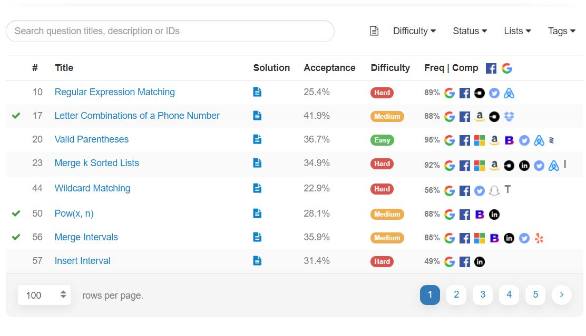

# LeetMore
Chrome extension to display frequency and company list to leetcode problems.
Open up problems list page in leetcode, the extension will do the rest.
<i> This is NOT leetcode premium, you will not get access to premium questions or faster submit queue. </i>

## Features
* Display frequency of question
* Display list of companies who asked this question
* Filter one or more companies to filter the problems
* Deselect filters easily by clicking the company icons displayed at the table header.

## Screenshots
<b> Frequency and Company list </b>

<b> Filter companies </b>

## Installation
* Download this repo
* Go to chrome exension page from setting
* Turn on developers mode at top right
* Click 'Load unpacked' and select LeetChromeExtension folder inside this repo.
* Now you are good to go. :)
